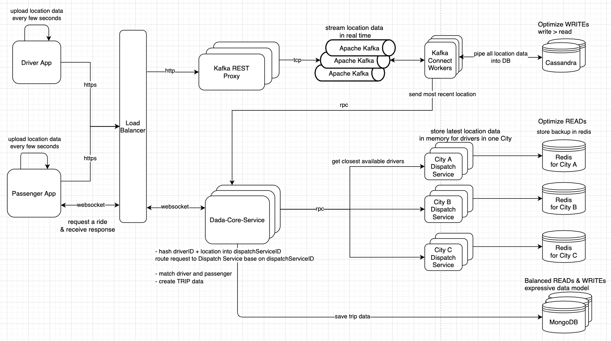
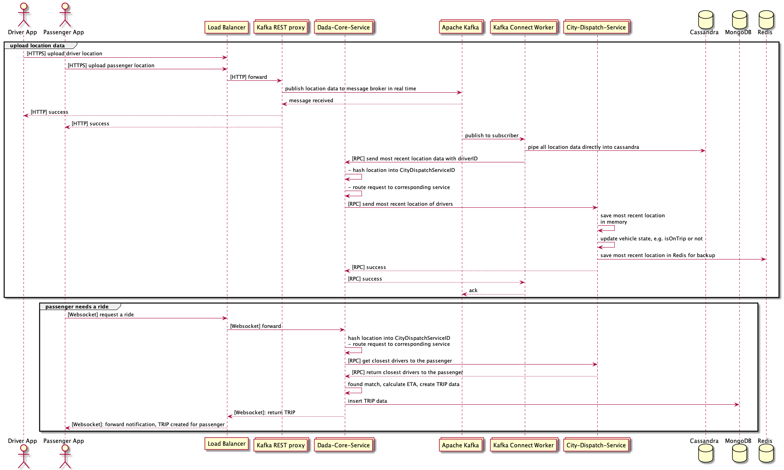

# Dada System Design

**Goals**: Dada is launching in one urban city of 5M people, but hopes to scale to multiple cities in 1 year.

**Features**:

1. Passengers and drivers use mobile phones to update their real-time location
2. When a passenger needs a ride, Dada's backend matches passengers with the driver closest to the passenger location

## Architecture Diagram



### Components

- `LoadBalancer` : take all requests and route to the available services
- `Kafka REST proxy`: takes HTTP request to receive location data from driver and passengers
- `Apache Kafka message broker`: supports streaming location data in real time
- `Kafka Connect worker`: supports pipe data into DB directly
- `Dada-Core-Service`: this is where the business logic resides, this is responsible for matching drivers and passengers, processing and saving trip data
- `City-Dispatch-Service`: state machine, storing most recent location data and vehicle state for drivers
- `Cassandra`: storing historical location data
- `MongoDB`: storing domain data such as driver, vehicle, user, trip
- `Redis`: storing most recent location data

## Sequence Diagram



## Database

Three different databases are chosen in this architecture.

1. `MongoDB`
   - expressive data model: good for storing domain object such as trip, vehicle, user, driver, etc
   - balanced performance for both read and write
   - schemaless: adding more features in the future will have to change DB schema, which makes Mongodb a perfect choice since it is very flexible.
2. `Cassandra`
   - key-value store that supports high volume of writes, good for storing location data uploaded every few seconds
   - supports sharding which means we can store all historical location data even if it's getting huge
3. `Redis`
   - in-memory store, good for storing most recent location data and can be persist on disk as backup

### MongoDB Schema

- 3 collections
  - Trip
  - Driver
  - User
- Design Goals:
  - driver:
    - find Trip by driverID
  - passenger:
    - find Trip by passengerID

```json
Trip: {
	_id: ObjectId,
  passenger: ObjectId,
  startTime: Date,
  startPoint: {
  	latitude: Number,
  	longitude: Number,
  	name: String
  }
  endPoint: {
    latitude: Number,
  	longitude: Number,
  	name: String
  }
  vehicle: {
  	_id: ObjectId,
    // adding more vehicle metadata as needed
  	brand: String,
  	seats: Number,
  	plateNumber: Number
  }
  driver: {
  	_id: OjbectId,
  	name: String
  }
  isFinished: Boolean,
  isCanceled: Boolean,
}

Driver: {
	_id: ObjectId,
  // adding more driver metadata as needed
	name: String,
	vehicles: [
		{
			_id: ObjectId,
			brand: String,
			seats: Number,
			plateNumber: Number
		}
	]
}

Passenger: {
	_id: ObjectId,
  // adding more passenger metadata as needed
	name: String,
}
```

### Cassandra Schema

```
CREATE TABLE "location" (
  id uuid,
  latitude float,
  longitude float,
  vehicleId uuid,
  driverId uuid,
  createdTime timestamp
)
```

### Redis Schema

use Redis Hashes to store the most recent location data

```shell
// example:
> hmset driver:{driverId} lon 10.3 lat 210.5 timestamp 612512141
```

## API Design

### POST /drivers/:driverID/location

- description: driver upload location

```js
Request Body: {
	driverID: string,
	location: string, // (lat, lon),
	onTrip: boolean,
	seats: number
}

Success Response:
HTTP Response Code: 201
{
  success: true,
}

Error Response:
HTTP Response Code: 400
{
	success: false,
  message: ""
}
```

### POST /passengers/:passengerId/location

- description: passenger upload location

```
Request Body:
{
	passengerID: string,
	location: string,
}

Success Response:
HTTP Response Code: 201
{
  success: true,
}

Error Response:
HTTP Response Code: 400
{
	success: false,
  message: ""
}
```

## Websocket Message Format

### Request a Ride

```
# Websocket Message Format
# Request
{
	location: string,
	filter: {
		seats: number,
	}
}

# Response for Requesting a Ride
{
	vehicle: {
		id: string
		brand: string,
		seats: number,
		plateNumber: number
	}
	driver: {
		name: string,
	}
	location: string
}

# Notification for updating driver location constantly
{
	vehicleId: string,
	location: string
}
```

## Sequence Diagrams

## "Must Have" Design Goals

### 1. Availability

Dada service must be constantly available for both drivers and passengers, one server crashes cannot bring down the whole system.

In this architecture, every service and database is running in cluster.

- `Infrastruture` like Kafka REST proxy, Message Broker and Kafka connect are running in cluster by themself.
- `Dada-Core-Service` is a stateless service and we will have a cluster of it, so it will be always available and one crashing server has no impact.
- `City-Dispatch-Service` is a stateful service which stores recent location data in memory, if one goes down, another service will keep continuing serve request and it can always retrieve data from Redis, and rebuild the most recent location data in memory.
- `Cassandra`, `MongoDB` has their own replication strategy to guarantee availability
- `Redis`: data store in Redis can be persist on disk, even if we lost these data, we are still able to retrieve location data from `Cassandra`

### 2. Scalability

Since this is a microservice architecture, it is very flexible for horizontally scaling. We can easily scale by adding more servers for City-Dispatch-Service for high demand City

### 3. Consistency

We have guaranteed availability and persistency but brings one problem that the location data is stored in different storage. We have location data stored in Cassandra, Redis and in City-Dispatch-Service application memory. This can cause data inconsistency.

In this distributed system architecture, we guaranteed the transactions of Cassandra are either committed or aborted, and accept that data in Redis and application memory may be lost. However, since drivers and passengers constantly uploading their location data every few seconds, and we only store the most recent location data in memory, it can be self corrected over the time and impact can be minimized as newer data are coming in.

After all, if we do lose data from application memory or Redis, we are always able to recover from data in Cassandra, so eventual consistency can be achieved.

### 4. Fault-tolerance

Many passengers may request a ride at same time in parallel, but one driver at any point of time can only have trip with one customer (if not sharing trip among customers).

This can be guaranteed by MongoDB document level transaction. even if City-Dispatch-Service return the same closest driver to many different passengers, when Dada-Core-Service inserting trip data(with driverID and passengerID), the `upsert` operation guarantees only one insertion will succeed.
